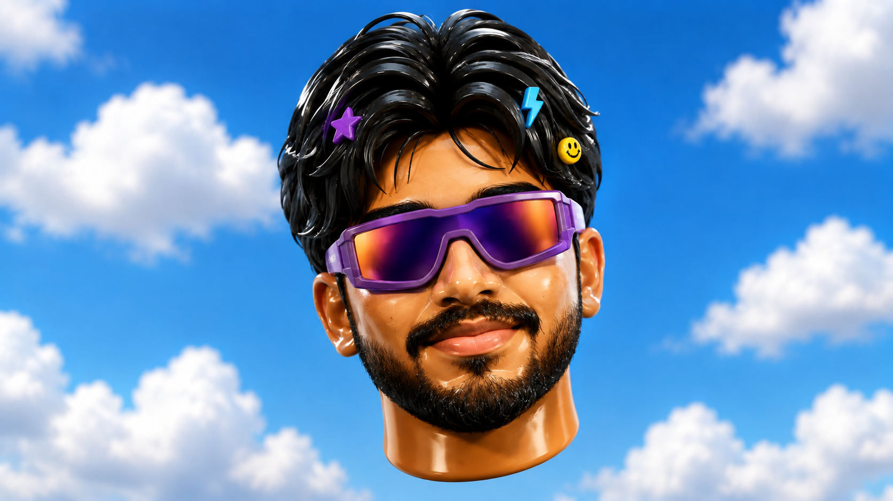

# Ayushmaan Portfolio — v0.1

Fast, dependency-free portfolio starter.

## Run locally

Option 1: double-click `index.html`.

Option 2 (recommended for development):

```bash
cd ayushmaan-portfolio
python -m http.server 5500
```

Then open http://localhost:5500

## File structure

```text
ayushmaan-portfolio/
├── index.html      # page content / text / sections
├── styles.css      # all visual styling
├── script.js       # cursor parallax + scroll reveal
└── assets/
    ├── hero-cartoon.png
    ├── dancing-miniature.mp4
    ├── resume-technical.pdf
    └── resume-artistic.pdf
```

## Adding the miniature video

1. Put your MP4 in `assets/`:
   `assets/dancing-miniature.mp4`
2. The contact section already references it.
3. Refresh the page.

The current video is intentionally:
- autoplay
- muted
- looping
- plays inline on mobile

Browsers generally block autoplay with sound. A later version can add a user-controlled music/player interaction.

## Changing text

Open `index.html` and search for the text you want to change.

Examples:
- Hero headline: `Engineer. Builder. Human.`
- About copy
- Project descriptions
- Skills
- Hobby cards
- Contact copy

## Changing colors

Open `styles.css` and edit the variables at the top:

```css
:root {
  --blue: #087cff;
  --purple: #7c3cff;
  --pink: #ff4fd8;
  --yellow: #ffd83d;
  --orange: #ff8a3d;
}
```

## Changing the hero image

Replace:

`assets/hero-cartoon.png`

with your new image, keeping the same filename, or change this line in `index.html`:

```html

```

## Changing links

Search `index.html` for:

- `https://github.com/`
- `https://www.linkedin.com/`
- `mailto:hello@example.com`

and replace them with your real links.

## Adding resumes

Put these files in `assets/`:

- `resume-technical.pdf`
- `resume-artistic.pdf`

The buttons already point to those filenames.

## Deploy

This is a static site, so it can be deployed directly to Vercel, Netlify, GitHub Pages, or any static host.

No npm install is required for this v0.1.

## Planned upgrades

- Google Flow hero animation
- richer project links/case-study pages
- scroll-triggered 3D
- dancing miniature contact experience
- YouTube music player
- mini arcade
